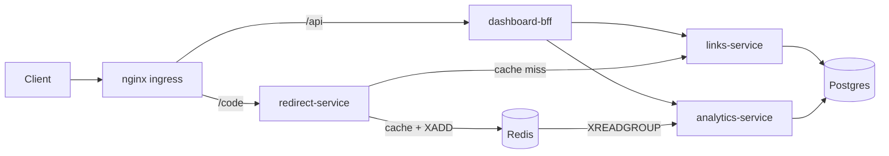

# Waypoint


> A spec-first URL shortener re-architected into 4 independent TypeScript services, deployed to Kubernetes with GitOps. Started as a single Express/Prisma API validated against an OpenAPI contract at runtime; evolved into a links/redirect/analytics/BFF split with an async click pipeline, Kubernetes on kind behind NGINX Ingress, and Argo CD managing every deploy straight from Git.

**Live Demo:** *Coming soon*

## Why This Project Stands Out

Most portfolio APIs are a single service thrown at a PaaS. Waypoint demonstrates two things real engineering teams actually do:

1. **Contract-first design** – The [OpenAPI 3.1 spec](services/links/spec/openapi.yaml) was written and linted before the first route handler existed, and `express-openapi-validator` rejects any request/response that drifts from it at runtime.
2. **Evolutionary architecture** – v1 was a single service with a synchronous DB write on every redirect. v2 splits it into 4 services, moves click tracking off the hot path onto a Redis Stream, and ships via GitOps instead of `kubectl apply`.

---

## 🏗️ Architecture



| Service | Responsibility |
|---|---|
| **links-service** | Spec-validated CRUD for links (create/list/get/delete). Internal only — never faces the public internet. |
| **redirect-service** | The hot path. Redis cache-aside lookup, falls back to links-service on a miss, publishes a click event to a Redis Stream, and returns a 302 — never waits on a database write. |
| **analytics-service** | Consumes the click stream via a Redis consumer group in batches of up to 200, writes to Postgres idempotently (`stream_id UNIQUE` + `ON CONFLICT DO NOTHING`), serves `GET /stats/:code`. |
| **dashboard-bff** | The only public API. Aggregates link + analytics data in parallel, and degrades gracefully (`analytics: { unavailable: true }`) if analytics-service is down instead of failing the whole request. |

`links-service` keeps the original spec-driven validation story from v1 — the OpenAPI contract still governs every request/response for that service.

### v1 → v2: What Changed

| Aspect | v1 | v2 |
|---|---|---|
| **Services** | 1 monolithic Express API | 4 independent services (links, redirect, analytics, bff) |
| **Click tracking** | Synchronous `UPDATE` on Postgres on every redirect | Async Redis Stream (`XADD`), consumed by a separate analytics-service |
| **Redirect hot path** | Blocks on a database write before responding | Cache-aside on Redis only; never touches a database |
| **Analytics** | A `clicks` column on the `Link` row | Dedicated Postgres schema (`analytics.click_events`) with per-referrer, per-day breakdowns |
| **Caching** | None | Redis cache-aside with TTL + negative caching for unknown codes |
| **Public surface** | links-service itself, directly exposed | Only dashboard-bff and redirect-service are public; links-service is internal-only |
| **Deployment target** | Docker container on Render | Kubernetes (kind) behind NGINX Ingress |
| **Deploy mechanism** | `git push` → Render auto-deploy | `git push` → GitHub Actions builds images to GHCR → Argo CD syncs the cluster (GitOps) |
| **Database migrations** | Run at container startup (`prisma migrate deploy` in `CMD`) | Run once as a Kubernetes Job, triggered as an Argo CD sync hook |
| **Scaling** | Single instance | Independently scaled Deployments per service (e.g. redirect/links run 2 replicas, analytics runs 1) |
| **Resilience** | A slow/down database blocks every request | BFF degrades gracefully if analytics is down; redirect-service degrades to a cache-miss fallback if Redis has stale data |
| **Rate limiting** | None | NGINX Ingress limits `/api/*` to 10 req/s (burst 20), redirects unaffected |
| **p99 redirect latency @ 500 req/s** | 763.42 ms | 8.28 ms |

---

## 🚀 Features

- **URL Shortening** – Auto-generated or custom short codes, with optional expiration
- **Async click analytics** – Redis Streams decouple click tracking from the redirect's response time
- **Graceful degradation** – The dashboard still works if analytics is temporarily down
- **Self-healing, horizontally scaled** – Kubernetes Deployments with liveness/readiness probes
- **GitOps deploys** – Argo CD syncs the cluster to whatever's committed to `deploy/overlays/local`; no manual `kubectl apply` after initial setup
- **Rate limiting at the edge** – NGINX Ingress limits `/api/*` to 10 req/s (burst 20) without throttling redirects

---

## 🛠️ Tech Stack

| Layer | Technology |
|---|---|
| **Language** | TypeScript 5.9, Node.js 24 |
| **Framework** | Express 5 |
| **Validation** | express-openapi-validator (links-service) |
| **Database** | PostgreSQL (Prisma ORM for links-service; raw `pg` for analytics-service's own schema) |
| **Cache / Messaging** | Redis (cache-aside + Streams for click events) |
| **Testing** | Jest + Supertest |
| **CI/CD** | GitHub Actions → builds 4 images to GHCR, bumps deploy tags automatically |
| **Orchestration** | Kubernetes (kind), Kustomize, NGINX Ingress Controller (F5 OSS) |
| **GitOps** | Argo CD |
| **Load testing** | k6 |

---

## 📋 API (via dashboard-bff)

| Method | Path | Description |
|---|---|---|
| `POST` | `/api/links` | Create a short link |
| `GET` | `/api/links` | List links, paginated, newest first |
| `GET` | `/api/dashboard/links/{code}` | Link metadata + analytics in one call |
| `DELETE` | `/api/links/{code}` | Delete a link |
| `GET` | `/{code}` | Redirect to the original URL (served by redirect-service directly, bypasses `/api`) |

```bash
curl -X POST http://localhost/api/links \
  -H "Content-Type: application/json" \
  -d '{"originalUrl":"https://github.com/vishnumuthyalu/waypoint-api","customCode":"repo"}'
# -> { "code": "repo", "shortUrl": "http://localhost/repo", ... }

curl -i http://localhost/repo
# -> 302 Found, Location: https://github.com/vishnumuthyalu/waypoint-api

curl http://localhost/api/dashboard/links/repo
# -> { ..., "analytics": { "totalClicks": 1, "topReferrers": [...] } }
```

---

## 🚦 Running It

**Docker Compose (all 6 services + nginx):**
```bash
docker compose up -d --build
# -> http://localhost:8080
```

**Kubernetes (kind + NGINX Ingress + Argo CD):**
```bash
kind create cluster --config deploy/kind-config.yaml
helm install nic oci://ghcr.io/nginx/charts/nginx-ingress --version 2.7.3 \
  -n nginx-ingress --create-namespace \
  --set controller.service.type=NodePort \
  --set controller.service.httpPort.nodePort=30080
kubectl apply -k deploy/overlays/local
# -> http://localhost
```

With Argo CD installed and the `waypoint` Application registered (`deploy/argocd/waypoint-app.yaml`), every `git push` to this repo is all that's needed to deploy — Argo CD syncs the cluster automatically.

---

## 🎯 Design Decisions

- **Click events go to a Redis Stream, not a synchronous write.** The redirect path only ever touches Redis on the hot path; analytics-service processes the stream independently. This is the single biggest architectural change from v1 (see [Results](#-results-v1-vs-v2) below).
- **Cache-aside with negative caching.** redirect-service caches both hits (`link:{code}` → JSON, 5 min TTL) and misses (`missing`, 30s TTL) so repeated 404s don't hammer links-service.
- **Idempotent analytics consumer.** A Redis consumer group with `stream_id UNIQUE` + `ON CONFLICT DO NOTHING` on the Postgres side means redelivered events (at-least-once delivery) never double-count.
- **BFF aggregates in parallel, degrades gracefully.** `Promise.allSettled` fetches link + analytics concurrently; if analytics is down, the dashboard still returns the link with `analytics: { unavailable: true }` instead of a 502.
- **Migrations run as a Kubernetes Job**, triggered as an Argo CD sync hook — not baked into every pod's startup, so scaling replicas never re-runs migrations.
- **NGINX Ingress Controller (F5 OSS)**, not the community `ingress-nginx` project — the latter was retired in March 2026 with no further security patches.
- **Analytics has its own Postgres schema** (`analytics.click_events`), so Prisma's migrations for links-service never see or touch it.

---

## 📊 Results: v1 vs v2

Load tested with k6 at a sustained 500 req/s for 60 seconds against the redirect path.

| Metric | v1 (sync DB write per click) | v2 (Redis Stream, async) |
|---|---|---|
| p99 redirect latency | **763.42 ms** | **8.28 ms** |
| p95 redirect latency | 575.97 ms | 4.06 ms |
| Sustained throughput | 485.9 req/s *(couldn't keep up — 517 dropped iterations, k6 exhausted all 300 VUs)* | 499.1 req/s *(met the 500 req/s target exactly)* |
| Request failure rate | 0.00% | 0.00% |
| Clicks recorded vs. sent | — | **30,000 / 30,000** (zero lost, even under load) |

**~92x improvement in p99 latency** by moving click tracking off the request's critical path. v1's synchronous write to Postgres on every single redirect meant the redirect endpoint itself became the bottleneck under load; v2's redirect path never touches a database at all, only Redis.

---

## 🔄 CI/CD Pipeline

On every push:
1. `test-links` — spins up an ephemeral Postgres container, lints the OpenAPI spec (Spectral), type-checks, lints, runs Jest, builds
2. `check-services` — type-checks and builds redirect/analytics/bff
3. `images` — builds and pushes all 4 service images to GHCR, tagged with the commit SHA
4. `bump-deploy` — a bot commits the new image tags into `deploy/overlays/local/kustomization.yaml`, which Argo CD then picks up and syncs automatically

No manual `docker push` or `kubectl apply` after the initial cluster bootstrap — deploys are just `git push`.

See [.github/workflows/ci.yml](.github/workflows/ci.yml).

---

## 📂 Project Structure

```
waypoint-api/
├── .github/workflows/ci.yml
├── docker-compose.yml
├── services/
│   ├── links/          # spec-validated CRUD, Prisma/Postgres
│   ├── redirect/       # hot path: Redis cache-aside + click stream publisher
│   ├── analytics/      # Redis consumer group -> Postgres, /stats/:code
│   └── bff/            # public API, aggregates link + analytics
├── deploy/
│   ├── nginx/nginx.conf        # docker-compose nginx config
│   ├── kind-config.yaml
│   ├── base/                   # Kustomize base manifests
│   ├── overlays/local/         # image tags pinned per environment
│   └── argocd/waypoint-app.yaml
├── loadtest/redirect.js        # k6 load test
└── README.md
```

---

## 🔮 Next

- JWT auth in the BFF
- Helm chart instead of raw Kustomize
- Prometheus/Grafana metrics
- Horizontal Pod Autoscaling (HPA)
- Rewrite redirect-service in Go (distroless image, lower idle memory)
- Sealed Secrets instead of plain Kustomize `secretGenerator`

---

## 🤝 Contact

**Vishnu Muthyalu**
📧 vm17college@gmail.com
🔗 [GitHub](https://github.com/vishnumuthyalu)
💼 [LinkedIn](https://linkedin.com/in/vishnumuthyalu)

---

**Built with a spec-first mindset, shipped with GitOps.**
